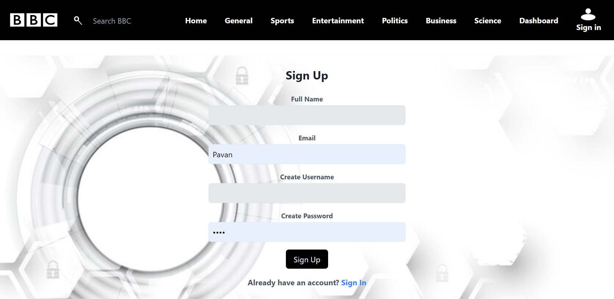
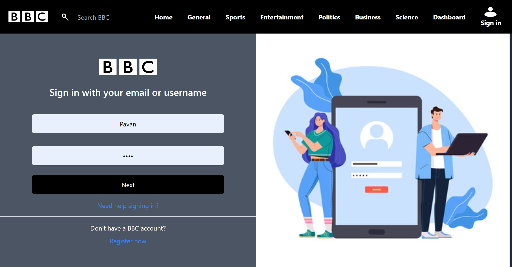
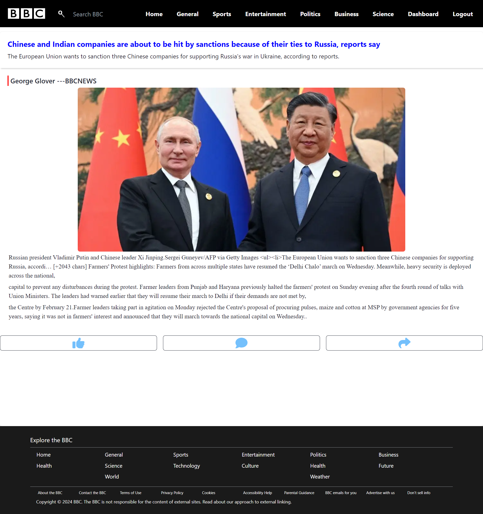

# bbc-news


## Introduction
This project aims to replicate the functionality and design of BBC News, providing a platform for users to access reliable and up-to-date news content. Inspired by the renowned BBC News website, this clone seeks to deliver a similar user experience, offering a diverse range of news categories, in-depth articles, multimedia content, and intuitive navigation.

## Team Members

    - Team Lead: [Saurabh Gangoly] 
    - Team Members: 
        [Pavan Kumar] 
        [Poornima Mohabe] 
        [Sachin Mohithe]
        [Sachin Kumanache]

## Project Type
Frontend | Backend | Fullstack

## Deplolyed App
    Frontend: https://bbc-news-lovat.vercel.app/
    Backend: https://bcc-news-backend.onrender.com/


## Directory Structure
      bbc-news/
      ├─.
      ├── backend
      │   ├── .gitignore
      │   ├── LICENSE
      │   ├── README.md
      │   ├── db.json
      │   ├── index.js
      │   ├── package-lock.json
      │   └── package.json
      └── frontend
          ├── public
          ├── src
          │   ├── Pages
          │   │   ├── Business.jsx
          │   │   ├── ContactPage.jsx
          │   │   ├── DashBoard.jsx
          │   │   ├── Entertainment.jsx
          │   │   ├── General.jsx
          │   │   ├── Health.jsx
          │   │   ├── HomePage.jsx
          │   │   ├── Politics.jsx
          │   │   ├── Science.jsx
          │   │   └── Sports.jsx
          │   ├── Redux
          │   │   ├── actionCreator.js
          │   │   ├── actionTypes.js
          │   │   ├── reducers.js
          │   │   └── store.js
          │   ├── Routes
          │   │   └── PrivateRoute.jsx
          │   ├── assets
          │   ├── components
          │   │   ├── BookMarkedCard.jsx
          │   │   ├── BookmarkSaved.jsx
          │   │   ├── CardComponent.jsx
          │   │   ├── ContactForm.jsx
          │   │   ├── Footer.jsx
          │   │   ├── MainSmallerCards.jsx
          │   │   ├── Navbar.jsx
          │   │   └── SingleNewsPage.jsx
          │   └── components1
          │       ├── AdminPage.jsx
          │       ├── Login.jsx
          │       ├── Science.jsx
          │       └── SignUp.jsx
          ├── .gitignore
          ├── README.md
          ├── index.html
          ├── package-lock.json
          ├── package.json
          ├── postcss.config.js
          ├── tailwind.config.js
          └── vite.config.js


### Features:
- **News Categories:** Provides a wide array of news categories including world news, politics, business, technology, science, health, and more.
- **Responsive Design:** Ensures seamless user experience across various devices and screen sizes, allowing users to access news anytime, anywhere.
- **Latest Updates:** Keeps users informed with the latest news updates through a constantly updated feed and breaking news alerts.
- **Multimedia Content:** Offers a rich multimedia experience with images, and interactive elements accompanying news articles.
- **Search Functionality:** Enables users to search for specific news topics or articles quickly and efficiently.
- **User Authentication:** Allows registered users to personalize their news feed, save articles for later reading, and engage with the community through comments and discussions.
- **Accessibility:** Prioritizes accessibility standards to ensure all users, regardless of abilities, can easily access and navigate the platform.


## Installation Usage:
1. Clone the repository:

git clone https://github.com/vpavan2105/bcc-news.git

2. Navigate to the project directory:

### Frontend:
```bash
cd bbc-news/frontend
npm install i
npm run dev
```

### Backend:
```bash
cd bbc-news/backend
npm install i
npm json-server --watch db.json --port 3001
```

3. Access the Application: "Once both the backend and frontend servers are running, you can access the application by opening your web browser and navigating to http://localhost:3000 (assuming the frontend server is running on port 3000). You should see the BBC News clone interface where you can explore news articles from various categories."

## Screenshots:

### SignupPage/RegisterPage



### SignInPage



### HomePage


### GeneralPage


### SigleNewsPage



### BookmarkPage


## Credentials:

To access authenticated pages, you can use the following credentials:

{
  "username": "user",
  "password": "1234"
},
{
  "username": "Pass",
  "password": "123"
}


## Technologies Used:
- **Frontend:** HTML5, CSS3, JavaScript (React.js)
- **Backend:** server.js, db.json
- **Deployment:** Vercel , Render


## Contributing:
Contributions are welcome! If you would like to contribute to this project, please follow these steps:
1. Fork the repository.
2. Create a new branch (`git checkout -b feature/improvement`).
3. Make your changes.
4. Commit your changes (`git commit -am 'Add new feature'`).
5. Push to the branch (`git push origin feature/improvement`).
6. Create a new Pull Request.


